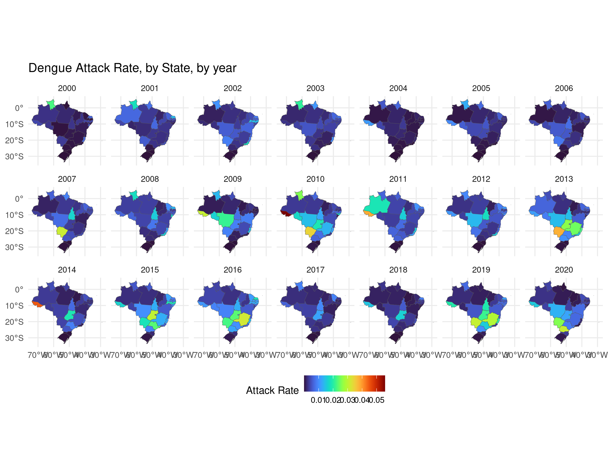

layout: true

```{r setup, include=FALSE}
options(htmltools.dir.version = FALSE)
knitr::opts_chunk$set(echo = FALSE)
```

```{r xaringan-themer, include = FALSE}
options(htmltools.dir.version = FALSE)
library(xaringanthemer)
library(xaringanExtra)
library(knitr)
library(DT)
library(RefManageR)
library(icons)
duo_accent(
  primary_color = "#A70000",
  secondary_color = "#ff0000",
  white_color = "white",
  header_font_google = google_font("Roboto Condensed"),
  text_font_google   = google_font("Roboto Condensed", "300", "300i"),
  code_font_google   = google_font("Ubuntu Mono"), text_font_size = "30px")
use_extra_styles(
  hover_code_line = TRUE, 
  mute_unhighlighted_code = TRUE)
```

---
class: left

## Find me at

.left-column[

  `r fontawesome::fa("github")` GitHub: [https://github.com/rafalopespx/](https://github.com/rafalopespx/)
  `r fontawesome::fa("mail-bulk")` [lopes1313@gmail.com](mailto:lopes1313@gmail.com)
  `r fontawesome::fa("twitter")` Twitter: [@rafalpx](www.twitter.com/rafalpx)

]

.pull-right[

  

]

---

## About me

+ Ph.D. Student in Physics, in the Instituto de Física Teóric - IFT/ UNESP-SP

+ I am in the last year of my Ph.D. and planning on defending on end of Abril/beginning of May, 22.

+ Now in Barcelona, in exchange period, in the Barcelona Institute for Global Health.

---

## Objectives and Questions

**How climate ECVs affects the counts of Cases due to Dengue, during a season of Dengue in Brazil, 2010-2019?**

Objectives: 

 -1) To quantify association of ECVs and counts of cases due to Dengue

 -2) To quantify confounding effects of others ECVs like humidity on the association of daily ambient temperature cases counts due to Dengue

 __-3) Quantify how the movement of people in Brazil affects the spreading of Dengue around the country__
---

## Dengue Disease

 -1) vector borne disease, human-mosquito-human cycle
 
 -2) incubation period of four- to six-day and persists until around the time fever abates, which is typically three to seven days, potential of cryptic transmissions

---

## Data sources and definitions:

- We have the Brazil national database of information system of severe notifications (SINAN), filtered for the cases of Dengue, aggregated by municipality, or health region, or any aggregation that is more suitable to the amount of cases.

- For the climate variable, we used the gridded daily ECVs taken from reanalysis products (ERA5Land) 

- We does a weighted mean area aggregation over the municipality extent area, to create matching time series for each municipality.

---

```{r geo, echo=FALSE, message=FALSE, warning=FALSE, out.width=800, fig.align='center'}

```

---

## Ideas and Plans

+ With the `epiflows` package, using together the Dengue Cases data and flight and/or movement data of Brazil, to estimate and understand how Dengue is introduced and spread over the country in a typical season.

+ With *spatial variations in temporal trends (SVTT)* estimate on how are the temporal trends of Dengue Cases around Brazil by municipality or any other administrative level of aggregation.

+ Any other idea that we can have.

---

class: middle, center
# Thank You!
# ¡Gracias!
# Obrigado!

`r fontawesome::fa("github")` GitHub: [https://github.com/rafalopespx/](https://github.com/rafalopespx/)
`r fontawesome::fa("mail-bulk")`  [lopes1313@gmail.com](mailto:lopes1313@gmail.com)
`r fontawesome::fa("twitter")` Twitter: [@rafalpx](www.twitter.com/rafalpx)

